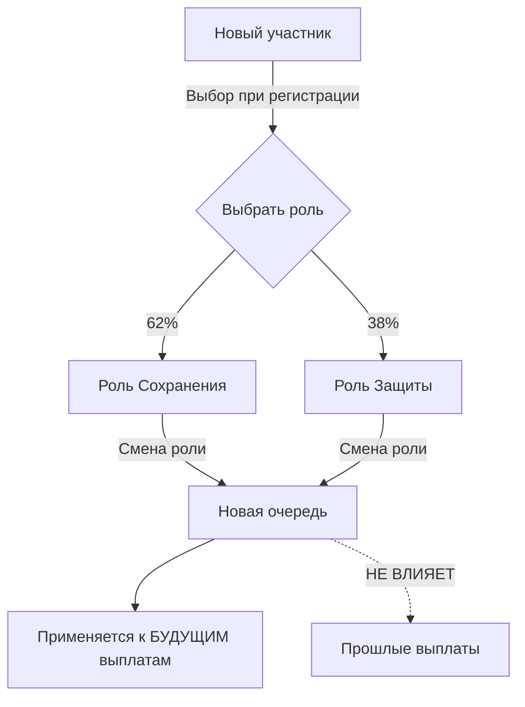
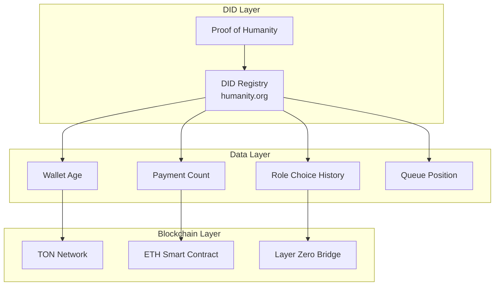
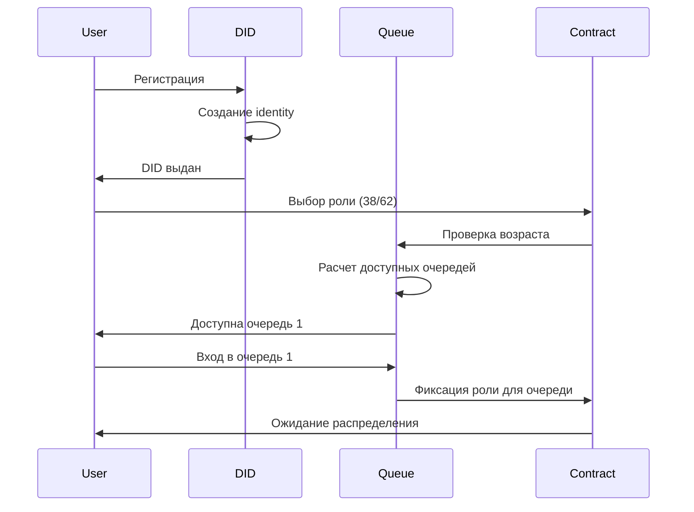
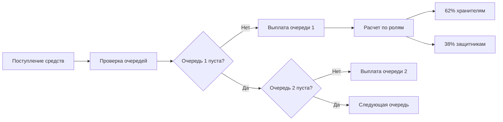
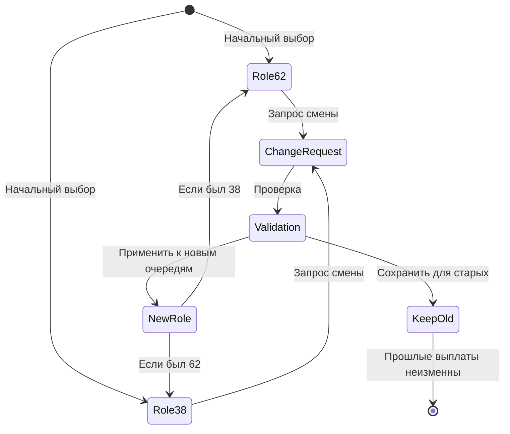

# φ-DAO: СИСТЕМА ОЧЕРЕДЕЙ И РАСПРЕДЕЛЕНИЯ

## 1. ВЫБОР РОЛИ 38/62 (Негендерная система)

### Философия выбора
Каждый человек сам выбирает свою роль в экосистеме, независимо от гендера:

```
РОЛЬ-62 "СОХРАНЕНИЕ" (Хранитель)
├─ Получает: 62% от распределений
├─ Функция: накопление, долгосрочная память, поддержание
└─ Метафора: сохранение огня цивилизации

РОЛЬ-38 "ЗАЩИТА" (Защитник)
├─ Получает: 38% от распределений
├─ Функция: расширение, добыча, оборона периметра
└─ Метафора: защита границ системы
```

### Механизм переключения



### Правила переключения
1. **Свободный выбор** — можно менять роль в любой момент
2. **Только вперед** — изменение применяется к новым очередям
3. **Необратимость прошлого** — нельзя изменить уже полученные выплаты
4. **Фиксация в очереди** — при входе в очередь роль фиксируется

---

## 2. СИСТЕМА ОЧЕРЕДЕЙ (Queue System)

### Базовая логика

```
ПРИНЦИП: Новички (дети) имеют приоритет, но справедливость через возраст

Очередь 1: Первая выплата (для новичков)
Очередь 2: Вторая выплата (минимальный возраст)
Очередь 3: Третья выплата (больший возраст)
...
Очередь N: N-я выплата (максимальный возраст)
```

### Алгоритм распределения

```python
# Псевдокод логики очередей

class QueueSystem:
    def __init__(self):
        self.queues = {}  # Номер очереди -> список ожидающих
        self.wallet_age = {}  # Адрес -> дата создания
        self.payment_count = {}  # Адрес -> количество выплат

    def join_queue(self, wallet_address, role_choice):
        age = get_wallet_age(wallet_address)
        payments_received = self.payment_count[wallet_address]

        # Определение доступных очередей
        available_queues = calculate_available_queues(age, payments_received)

        # Вход в минимальную доступную очередь
        min_queue = min(available_queues)
        self.queues[min_queue].append({
            'wallet': wallet_address,
            'role': role_choice,  # 38 или 62
            'timestamp': now(),
            'locked_role': True  # Роль зафиксирована для этой очереди
        })

    def distribute_rewards(self, total_amount):
        # Приоритет: сначала очередь 1, потом 2, и т.д.
        for queue_num in sorted(self.queues.keys()):
            if total_amount <= 0:
                break

            queue = self.queues[queue_num]
            for participant in queue:
                if participant['role'] == 62:
                    payment = total_amount * 0.62
                else:
                    payment = total_amount * 0.38

                send_payment(participant['wallet'], payment)
                self.payment_count[participant['wallet']] += 1
                total_amount -= payment
```

### Пример на яблоках

```
СИТУАЦИЯ:
- Алиса получила 3 выплаты (1🍎, 2🍎, 3🍎)
- Боб только присоединился

РАСПРЕДЕЛЕНИЕ:
День 1: Боб встает в Очередь 1 → получает 1🍎 (приоритет новичку)
День 2: Боб встает в Очередь 2 → получает 2🍎
День 3: Боб встает в Очередь 3 → получает 3🍎

ВОЗРАСТНОЙ ФАКТОР:
Если минимальный возраст для Очереди 2 = 2 месяца:
- Новый участник (0 месяцев) → только Очередь 1
- Участник 2+ месяца → может в Очередь 1 или 2
- Участник 6+ месяцев → может в Очереди 1, 2 или 3
```

---

## 3. DID СИСТЕМА (humanity.org)

### Архитектура



### Хранимые данные

```json
{
  "did": "did:humanity:0x1234...abcd",
  "wallet_created": "YYYY-MM-DDThh:mm:ssZ",
  "payment_history": [
    {
      "queue_number": 1,
      "amount": "1.0",
      "role": 62,
      "timestamp": "YYYY-MM-DDThh:mm:ssZ",
      "locked": true
    },
    {
      "queue_number": 2,
      "amount": "2.0",
      "role": 38,
      "timestamp": "YYYY-MM-DDThh:mm:ssZ",
      "locked": true
    }
  ],
  "current_role": 62,
  "role_changes": [
    {
      "from": 62,
      "to": 38,
      "timestamp": "YYYY-MM-DDThh:mm:ssZ",
      "applies_from_queue": 3
    }
  ],
  "queue_eligibility": {
    "max_queue": 3,
    "based_on_age": "3 months",
    "based_on_payments": 2
  }
}
```

---

## 4. ТЕХНОЛОГИИ: API-MONEY vs φ-ROUTER

### API через деньги (API-Money)

```solidity
// ТЕХНОЛОГИЯ 1: API-MONEY
// Последняя цифра транзакции = команда

receive() external payable {
    uint8 command = extractLastDigit(msg.value);
    // 0.01 → команда 1
    // 0.02 → команда 2
    // Простой парсинг цифры
}
```

**Характеристики:**
- Универсальная для любого блокчейна
- Не требует ABI
- Работает с любым кошельком
- Патентуемая технология

### φ-Router (Маршрутизация по золотому сечению)

```solidity
// ТЕХНОЛОГИЯ 2: φ-ROUTER
// Интеллектуальная маршрутизация через φ-пропорции

contract PhiRouter {
    function route(uint256 amount) internal {
        uint256 golden = (amount * 618) / 1000;  // 61.8%
        uint256 silver = (amount * 382) / 1000;  // 38.2%

        // Автоматическое распределение по φ
        liquidPool += golden;
        permanentPool += silver;

        // Рекурсивная маршрутизация
        if (shouldSplit(amount)) {
            route(golden);  // Рекурсия с φ
        }
    }
}
```

**Характеристики:**
- Математически оптимальное распределение
- Самоподобная структура (фрактальность)
- Защита от атак через φ-баланс
- Отдельная патентуемая технология

### Сравнение технологий

| Аспект | API-Money | φ-Router |
|--------|-----------|----------|
| **Цель** | Упрощение интерфейса | Оптимизация распределения |
| **Метод** | Парсинг последней цифры | Золотое сечение |
| **Патент** | Способ управления через транзакции | Алгоритм маршрутизации |
| **Применение** | Любые команды | Финансовые потоки |

---

## 5. БИЗНЕС-ПРОЦЕССЫ

### Процесс присоединения



### Процесс распределения



### Процесс смены роли



---

## 6. ЭКОНОМИЧЕСКАЯ МОДЕЛЬ

### Стимулы системы

1. **Для новичков**: Приоритет в первой очереди
2. **Для старожилов**: Доступ к множественным очередям
3. **Для хранителей (62%)**: Больший процент, стабильность
4. **Для защитников (38%)**: Активная роль, защита системы

### Баланс системы

```
ВХОД: 100 единиц
├─ Очередь 1: 40% (приоритет новичкам)
├─ Очередь 2: 30% (средний возраст)
├─ Очередь 3: 20% (старожилы)
└─ Резерв: 10% (безопасность)

ВНУТРИ ОЧЕРЕДИ:
├─ Хранители: 62% от суммы очереди
└─ Защитники: 38% от суммы очереди
```

---

## ВЫВОДЫ

Система очередей φ-DAO решает ключевые проблемы:

1. ✅ **Гендерная нейтральность** — выбор роли по функции, не по полу
2. ✅ **Справедливость** — новички приоритетны, но старожилы не забыты
3. ✅ **Гибкость** — можно менять роль для будущего
4. ✅ **Необратимость** — нельзя изменить прошлое
5. ✅ **Прозрачность** — все данные в децентрализованном DID

*"Система, где каждый выбирает давать или получать больше, но не может изменить прошлое — это и есть настоящая справедливость."*
