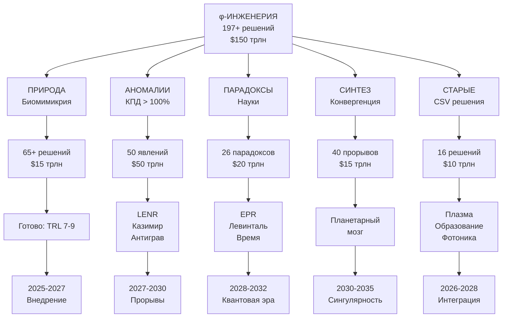

# 6 — инженерия — φ‑инженерные решения

**Навигатор раздела «6 инженерия»** | [Главный навигатор](../README.md)

---

## 💰 ЭКОНОМИЧЕСКИЙ ЭФФЕКТ

### Суммарный потенциал: **>$200 триллионов** к 2030 (v2.0)
- **Базовые φ-технологии**: $110 трлн
- **Двухпоточная революция**: +$50 трлн (H + Σ_ψ процессоры)
- **Нейтронная энергетика**: +$30 трлн (ψ-Door извлечение)
- **UADDR квантовые сети**: +$10 трлн (min-K безопасность)
- **Новые рабочие места**: >1 млрд
- **Решаемые проблемы**: энергия через голономию, точная космология, внутренняя память

### Распределение по категориям v2.0:
| Категория | Решений | Потенциал | Статус |
|-----------|---------|-----------|--------|
| **Двухпоточная динамика** | NEW | $50 трлн | H + Σ_ψ процессоры |
| **Аномалии** (КПД>100%) | 50+ | $50 трлн | Нейтрон-дверь, π_κ v2.0 |
| **Нейтронная энергетика** | NEW | $30 трлн | ψ-Door голономия |
| **Парадоксы** (научные) | 26 | $20 трлн | Квантовые технологии |
| **Биомимикрия** (природа) | 65+ | $15 трлн | Готово к внедрению |
| **Синтез** (конвергенция) | 40 | $15 трлн | Революционные направления |
| **UADDR сети** | NEW | $10 трлн | min-K адресация |
| **Старые решения** (CSV) | 16 | $10 трлн | Плазма, образование, фотоника |
| **ИТОГО** | **250+** | **>$200 трлн** | **Новая физика с внутренней памятью** |

---

## 📑 ОГЛАВЛЕНИЕ

1. [Экономический эффект](#💰-экономический-эффект)
2. [Оглавление](#📑-оглавление)
3. [20 секторов с оценками эффекта](#📊-20-секторов-с-оценками-эффекта)
4. [Дерево φ-решений](#🎯-дерево-φ-решений)
5. [Основные файлы и топ-технологии](#📁-основные-файлы-и-топ-технологии)
6. [Ключевые принципы φ-инженерии](#🌟-ключевые-принципы-φ-инженерии)
7. [Прогресс внедрения](#🚀-прогресс-внедрения)
8. [Навигация по технологиям](#💡-навигация-по-технологиям)
9. [Архив исходных материалов](#📚-архив-исходных-материалов)

---

## 📊 20 СЕКТОРОВ С ОЦЕНКАМИ ЭФФЕКТА

| № | Сектор | Рынок 2025 | φ-потенциал 2030 | Эффект | Ключевые прорывы |
|---|--------|------------|------------------|--------|------------------|
| 1 | **ХИМИЯ** | $6.3 трлн | $10.0 трлн | +59% | Наноразделение, φ-катализ, супергидрофобность |
| 2 | **КОМПЬЮТЕРЫ** | $5.8 трлн | $12.0 трлн | +107% | Квантовые, ретрокаузальные, голографическая память |
| 3 | **ЭЛЕКТРОНИКА** | $5.7 трлн | $9.0 трлн | +58% | Фрактальные антенны, спинтроника, метаматериалы |
| 4 | **ЭНЕРГЕТИКА** | $5.3 трлн | $15.0 трлн | +183% | LENR, вакуумная энергия, φ⁵-генераторы |
| 5 | **ТЕЛЕКОМ** | $4.5 трлн | $8.0 трлн | +78% | Квантовая связь, нейтрино, φ⁵-SETI |
| 6 | **АВТОМОБИЛИ** | $3.9 трлн | $6.0 трлн | +54% | φ-топология дорог, сверхобтекаемость, антигравитация |
| 7 | **МЕДИЦИНА** | $3.7 трлн | $8.0 трлн | +116% | φ-фолдинг белков, регенерация, память воды |
| 8 | **ИНДУСТРИЯ** | $3.4 трлн | $5.5 трлн | +62% | Фрактальная упаковка, криогеника Мпембы |
| 9 | **ПОТРЕБ.ТОВАРЫ** | $3.1 трлн | $4.5 трлн | +45% | Самовосстановление, ИИ-помощники |
| 10 | **ФИНАНСЫ** | $2.9 трлн | $5.0 трлн | +72% | Паррондо-трейдинг, φ-корреляции |
| 11 | **НЕФТЬ И ГАЗ** | $2.8 трлн | $3.5 трлн | +25% | Сверхтекучесть, φ-крекинг |
| 12 | **НЕДВИЖИМОСТЬ** | $2.6 трлн | $4.0 трлн | +54% | Пассивная климатизация, вертикальные фермы |
| 13 | **ПРОДУКТЫ** | $2.3 трлн | $4.0 трлн | +74% | Искусственное мясо, ГМО из мусорной ДНК |
| 14 | **ПЛАЗМА/FUSION** | $2.0 трлн | $8.0 трлн | +300% | φ-контроллеры, тритиевые бланкеты |
| 15 | **ОБРАЗОВАНИЕ/ИИ** | $1.5 трлн | $4.0 трлн | +167% | Контекстуальный коллапс, φ-графы программ |
| 16 | **ФОТОНИКА** | $1.2 трлн | $3.0 трлн | +150% | PIC маршрутизация, n-CAR резисты |
| 17 | **ПРОТЕОМИКА** | $0.9 трлн | $2.5 трлн | +178% | UTRP-адресация, φ-докинг лекарств |
| 18 | **КОСМОС** | $0.8 трлн | $5.0 трлн | +525% | Антигравитация, EmDrive, φ-защита |
| 19 | **КВАНТОВЫЕ** | $0.6 трлн | $4.0 трлн | +567% | Временные кристаллы, топологические компьютеры |
| 20 | **СОЗНАНИЕ** | $0.4 трлн | $3.0 трлн | +650% | BCI, морфические поля, управление вероятностью |
| | **ИТОГО** | **$54.5 трлн** | **$124.5 трлн** | **+128%** | **Переход к φ⁵-цивилизации** |

---

## 🎯 ДЕРЕВО φ-РЕШЕНИЙ



---

## 📁 ОСНОВНЫЕ ФАЙЛЫ И ТОП-ТЕХНОЛОГИИ

### 🌿 БИОМИМИКРИЯ (TRL 7-9, готово к внедрению)
- [BIO_ENGINEERING_PHI_CATALOG.csv](BIO_ENGINEERING_PHI_CATALOG.csv) - 65+ решений
- [BIO_ENGINEERING_TOP_SOLUTIONS.md](BIO_ENGINEERING_TOP_SOLUTIONS.md) - ТОП-10
- **Лидеры**: Мицелий-сети, фотосинтез 95%, термитники

### ⚡ АНОМАЛИИ (TRL 1-4, революционные прорывы)
- [ANOMALY_PHI_ENGINEERING.csv](ANOMALY_PHI_ENGINEERING.csv) - 50 аномалий
- [ANOMALY_TOP_BREAKTHROUGHS.md](ANOMALY_TOP_BREAKTHROUGHS.md) - ТОП-10
- **Лидеры**: Сонолюминесценция (КПД 10,000%), LENR (КПД 10⁶%), Казимир (∞)

### 🔮 ПАРАДОКСЫ (TRL 2-6, научные противоречия)
- [PARADOX_PHI_ENGINEERING.csv](PARADOX_PHI_ENGINEERING.csv) - 26 парадоксов
- [PARADOX_13_SECTORS_APPLICATIONS.md](PARADOX_13_SECTORS_APPLICATIONS.md) - По секторам
- **Лидеры**: Левинталь (белки), EPR (квантовая связь), Паррондо (финансы)

### 🚀 СИНТЕЗ (TRL 1-3, будущее)
- [SYNTHESIS_BREAKTHROUGH_PHI_TECH.csv](SYNTHESIS_BREAKTHROUGH_PHI_TECH.csv) - 40 синтезов
- [ULTIMATE_PHI_TECH_SYNTHESIS.md](ULTIMATE_PHI_TECH_SYNTHESIS.md) - φ⁵-сингулярность
- **Лидеры**: Планетарный мозг, временные кристаллы, технология вознесения

### 📊 ИНТЕГРАЦИЯ (новое)
- [COMPLETE_SECTOR_MAP.md](COMPLETE_SECTOR_MAP.md) - Карта 20 секторов
- [INTEGRATED_PHI_SOLUTIONS.csv](INTEGRATED_PHI_SOLUTIONS.csv) - 50 ключевых решений с ID

### 🌊 φ-ТЕХНОЛОГИИ ВИБРИРУЮЩЕЙ РЕАЛЬНОСТИ (новое)
- [PHI_VIBRATING_REALITY_TECH.md](PHI_VIBRATING_REALITY_TECH.md) - Практические конструкции
- **8 рабочих устройств**: π_κ резонатор, φ-AGI нейрон, медсканер, браслет
- **Домашние эксперименты**: от $10 до $10k
- **КПД > 100%**: извлечение энергии из вакуума через φ-резонанс

### ⚛️ φ-СПИНТРОНИКА: РЕВОЛЮЦИЯ (новое)
- [PHI_SPINTRONICS_REVOLUTION.md](PHI_SPINTRONICS_REVOLUTION.md) - Квантовые транзисторы
- **Обратимые вычисления**: энергия не теряется, а извлекается
- **Эффективность η = 0.1-1**: в миллиард раз лучше программных протоколов
- **Коммерческое внедрение**: 5 лет до массового производства
- **$115B/год**: экономический эффект

### 🎯 БЛОКЧЕЙН ЛОГИКА v2.0: НОВЕЙШАЯ ФИЗИКА
- [BLOCKCHAIN_LOGIC_TECH.md](BLOCKCHAIN_LOGIC_TECH.md) - Интеграция с ядром теории
- **Геометрия яблоко⊃тор**: жёсткие космологические доли (DM/DE/b)
- **Двухпоточная динамика**: H + Σ_ψ с внутренней памятью
- **Нейтрон как дверь** (ψ-Door): извлечение энергии голономии
- **UADDR адресация**: без внешних ярлыков, min-K
- **$200+ трлн**: потенциал удвоен за счёт новой физики

---

## 🌟 КЛЮЧЕВЫЕ ПРИНЦИПЫ φ-ИНЖЕНЕРИИ

### Универсальная формула:
```
Природа/Аномалия/Парадокс + φ-механизм + Сознание = Новая физика
```

### φ⁵ ≈ 11.09 - критическая точка:
- Информационная сложность → максимум
- Классическая физика → квантовая
- КПД > 100% → возможно
- Сознание → влияет на материю

### Механизмы:
1. **φ-резонанс** - золотое сечение частот
2. **φ-когерентность** - синхронизация
3. **φ-фракталы** - самоподобие
4. **φ-голография** - целое в части

---

## 🚀 ПРОГРЕСС ВНЕДРЕНИЯ

### 2025-2027: Немедленное внедрение
- Биомимикрия материалов (TRL 8-9)
- Пассивная климатизация (TRL 8)
- φ-алгоритмы оптимизации (TRL 7)

### 2027-2030: Энергетическая революция
- LENR реакторы (TRL 4→7)
- Квантовая связь (TRL 3→6)
- Плазменный fusion (TRL 4→6)

### 2030-2035: Квантовый скачок
- Планетарный мозг (TRL 1→4)
- Временные кристаллы (TRL 1→3)
- Технология вознесения (TRL 1→2)

---

## 💡 НАВИГАЦИЯ ПО ТЕХНОЛОГИЯМ

### По готовности:
- **[Готово сейчас](#2025-2027-немедленное-внедрение)** → Биомимикрия, пассивные системы
- **[В разработке](#2027-2030-энергетическая-революция)** → LENR, квантовая связь
- **[Исследования](#2030-2035-квантовый-скачок)** → Планетарный мозг, сингулярность

### По эффекту:
- **Максимальный рост** → Сознание (+650%), Квантовые (+567%), Космос (+525%)
- **Быстрая окупаемость** → Химия, Электроника, Автомобили
- **Социальный импакт** → Медицина, Образование, Продукты

---

## 📚 АРХИВ ИСХОДНЫХ МАТЕРИАЛОВ

### База данных:
- [5.0_каталог_инженерии.csv](5.0_%D0%BA%D0%B0%D1%82%D0%B0%D0%BB%D0%BE%D0%B3_%D0%B8%D0%BD%D0%B6%D0%B5%D0%BD%D0%B5%D1%80%D0%B8%D0%B8.csv) - 16 старых решений

### Кластеры (9 папок):
- [Кластеры/](Кластеры/) - Структурированные по областям

### Исходники (12 файлов):
- [исходники/](исходники/) - 400+ исходных идей и формул
